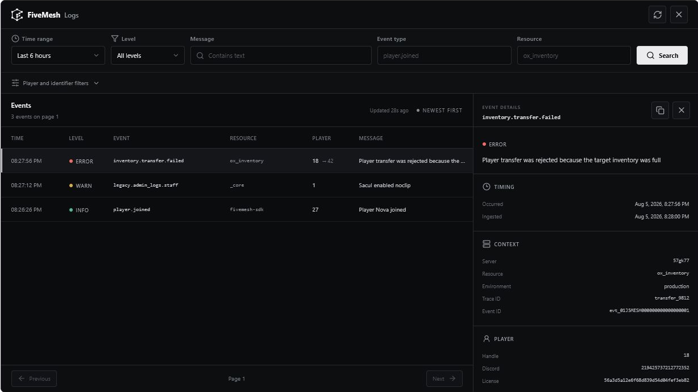
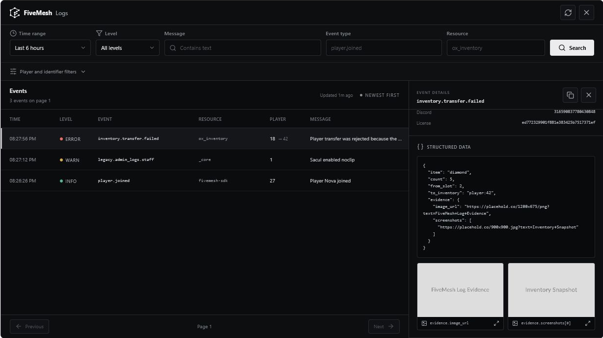

# FiveMesh Logs for FiveM

FiveMesh Logs is an in-game staff viewer for logs produced by your FiveM
server. Authorized staff open it with a command, search the same source
connected in FiveMesh, inspect player identifiers and structured event data,
and paginate through the newest results.

The resource requires `fivemesh-sdk` 0.1.5 or newer. All FiveMesh API calls
happen in the SDK's server runtime.

## Preview

These screenshots use synthetic data from the resource's included browser
preview environment.

### Search and inspect events

[](docs/images/logs-explorer.png)

Filter logs by time range, level, message, event type, resource, player handle,
or an exact player identifier. Selecting an event opens its timing, resource,
player and target-player context without leaving the game.

### Structured data and image evidence

[](docs/images/logs-structured-data.png)

Structured event data stays readable as JSON. Safe image URLs are detected
inside nested objects and arrays, displayed as thumbnails, and can be enlarged
inside the viewer.

## Install

Build both resources and keep their resource folder names as `fivemesh-sdk` and
`fivemesh-logs`.

```sh
pnpm install
pnpm build
```

Create a FiveMesh API key with `logs:read` — ideally one that is specific to this
server — then configure the SDK and staff permission before starting the
resources:

```cfg
set FIVEMESH_LOGS_QUERY_API_KEY "fm_live_..."

add_ace group.admin fivemesh.logs.view allow

ensure fivemesh-sdk
ensure fivemesh-logs
```

A server-specific key already names its server, so `FIVEMESH_SERVER_ID` is only
required when the query key is global (all servers):

```cfg
set FIVEMESH_SERVER_ID "your-cfx-server-id"
```

The SDK checks the key on start and logs the organization, bound server and
permissions to the server console.

Staff with the ACE permission can run:

```txt
/fmlogs
```

If ingestion uses a separate key, keep both credentials narrowly scoped:

```cfg
set FIVEMESH_LOGS_API_KEY "fm_live_logs_write_key"
set FIVEMESH_LOGS_QUERY_API_KEY "fm_live_logs_read_key"
```

## Configuration

| ConVar                         | Default              | Description                                                 |
| ------------------------------ | -------------------- | ----------------------------------------------------------- |
| `FIVEMESH_LOGS_VIEWER_COMMAND` | `fmlogs`             | In-game command used to open the viewer.                    |
| `FIVEMESH_LOGS_VIEWER_ACE`     | `fivemesh.logs.view` | ACE permission re-checked when opening and on every search. |

Set these ConVars before `ensure fivemesh-logs`.

You can grant the viewer to a dedicated staff principal instead of all admins:

```cfg
add_principal identifier.discord:123456789012345678 group.logs_staff
add_ace group.logs_staff fivemesh.logs.view allow
```

## Security model

- The resource has a hard dependency on `fivemesh-sdk`.
- The client and NUI never receive the API key.
- NUI requests cannot select a server, workspace, or billing owner.
- The server validates every filter and rejects unknown fields.
- ACE authorization is checked for every query, not only when the panel opens.
- Only one query per player can run at a time, with a short per-player throttle.
- Pagination cursors are opaque values created and verified by the FiveMesh API.

The browser displays sensitive identifiers only inside an event's detail view.
Grant the ACE permission only to staff who are authorized to view those values.

## Development

```sh
pnpm type-check
pnpm test
pnpm build
```

The NUI includes sample data for layout development. Run Vite in development,
or append `?preview=1` when opening a production preview build. Preview mode is
never enabled by default inside FiveM.

## License

MIT
